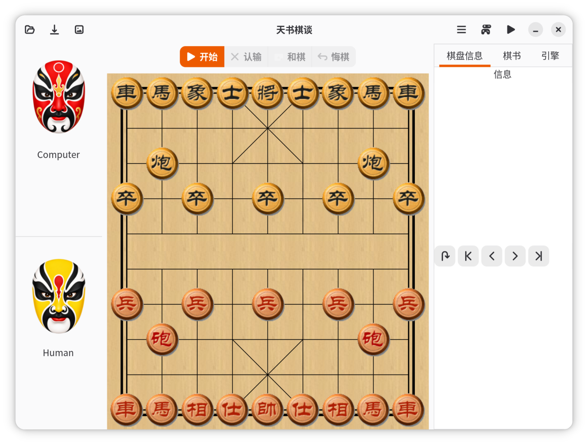

# GMChess



GMChess is a Chinese chess (Xiangqi) desktop game for Linux. The current
branch has been refreshed around GTK4, Meson, Debian packaging, and updated
application artwork.

## Current Status

- Version: `0.40.1`
- UI toolkit: GTK4 + libadwaita
- Build system: Meson + Ninja
- Packaging: Debian/Ubuntu `.deb` support is included
- Gameplay: human-versus-engine play, free play, and game-record handling
- Engine: bundled EleEye/xqwizard-derived Chinese chess engine
- Resources: bundled board themes, sound effects, application icons, and player
  avatars

The old gtkmm UI has been removed from the active application code. The GTK
interface now uses GTK4 APIs, including GTK4 list models/views and non-deprecated
dialog and file-selection APIs where applicable.

## Build

Install the build dependencies on Ubuntu/Debian:

```sh
sudo apt install build-essential meson ninja-build pkg-config gettext libgtk-4-dev libadwaita-1-dev
```

Build the project:

```sh
meson setup builddir-gtk4
meson compile -C builddir-gtk4
```

Run the local build:

```sh
./builddir-gtk4/src/gmchess
```

The local build resolves bundled resources and the engine from the source/build
tree, so it can be run before installation.

## Debian Package

Build a binary Debian package:

```sh
./build-deb.sh
```

Generated packages are placed in the sibling `builds/` directory, for example:

```text
../builds/gmchess_0.40.1_amd64.deb
```

There is also a source package helper:

```sh
./build-source.sh
```

## Assets

Application icons are installed both as the main `gmchess.png` resource and as
hicolor icons in common desktop sizes. Player avatars and the current-turn marker
are bundled in `data/`.

The GitHub preview image lives at:

```text
doc/images/preview.png
```

## License And Origin

GMChess is released under GPLv2. See `COPYING`.

The chess engine is based on xqwizard:

```text
https://sourceforge.net/projects/xqwizard/
```

xqwizard is also released under GPLv2. GMChess also includes some data derived
from that project, such as `book.dat`.

The original GMChess project was migrated from Google Code to GitHub by lerosua.
This branch continues the codebase with GTK4 and packaging updates.
